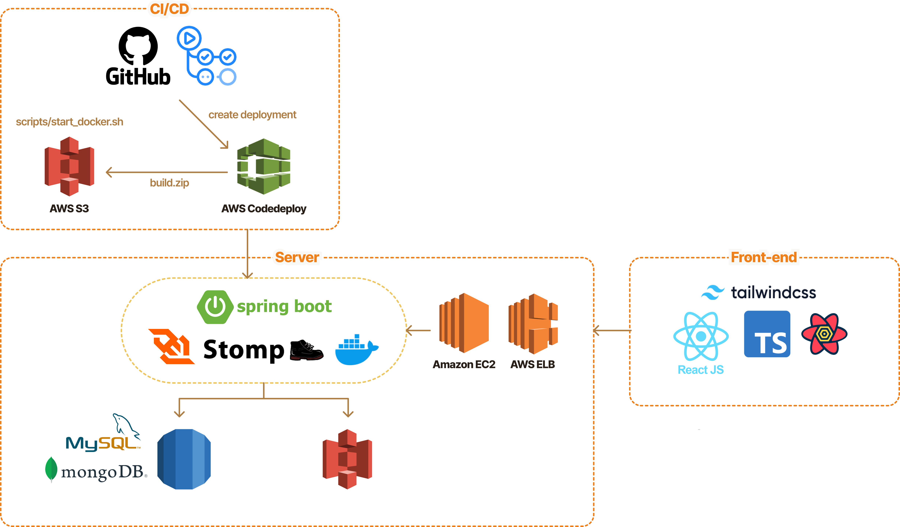

   
  

   
  <h1>플렛지 (Fledge)</h1>
   

## 목차

1. [**웹 서비스 소개**](#1)
2. [**서비스 아키텍쳐**](#2)
3. [**기술 스택 및 기술적 의사결정**](#3)
4. [**주요 기능**](#4)
5. [**개발팀 소개**](#5)
    

## 💁 웹 서비스 소개

**플렛지(Fledge)** 는 자립준비청년들이 안전하고 투명한 지원을 통해 자신의 꿈을 이룰 수 있도록 후원자와 멘토가 함께하는 신뢰의 네트워크를 통해 청년들의 지속 가능한 자립을 지원하는 서비스입니다.

## 📂 서비스 아키텍처

## 🛠 기술 스택 및 기술적 의사결정

  

    
    
    
    
    
    
  

   

| 📌 사용 기술                    | 📖 기술 설명                                                                                                                                                                                                                                                                                                                                                                                        |
| ------------------------------- | --------------------------------------------------------------------------------------------------------------------------------------------------------------------------------------------------------------------------------------------------------------------------------------------------------------------------------------------------------------------------------------------------- |
| React                           | - 컴포넌트 단위 개발을 통 반복되는 것들을 재사용하여 생산성과 유지보수성이 높다.  - 가상돔을 활용하여 데이터가 변할 때마다 화면을 새로 띄우는게 아니라, 필요한 부분만 업데이트 해줘서 서비스의 성능과 반응성이 높다.  - 데이터가 부모에서 자식으로 전달되기 때문에(데이터 흐름이 한 방향으로 고정되어 있기 때문에) 상태 흐름 예측에 쉽고 디버깅이 쉽다.                                       |
| Typescript                      | - 기존 JS는 동적 타입 언어로 변수 타입 선언을 안해도 되는 유연성이 있지만, 런타임에서의 오류 발생 가능성이 높았다. (사이트 에러, 콘솔창 에러)  - TS는 정적 타입 시스템으로, 컴파일 시점에 타입체크를 통해 오류를 방지하여 프로그램의 안정성을 높일 수 있다. (실행전에 에러 미리 알려줌)  - 프로젝트 규모가 커질수록 효과적이다.  - api 결과 부분에 타입을 지정해서 유지보수에 도움이 된다. |
| Tailwind CSS, Styled-components | - 성능 및 번들 크기 측면에서 TailwindCSS가 유용하지만, 코드 작성 측면에서 컴포넌트의 가독성과 유지보수성을 저해하고, 조건부나 동적 스타일링이 어려운 문제점이 있었다. 이 단점을 보완하고자, 유연한 스타일링이 가능한 Styled-components를 함께 사용하여 각 기술의 장점을 살리고자 채택하였다.                                                                                                        |
| React Query (tanstack-query)    | - 서버상태를 비동기적으로 가져오고, 캐싱, 지속적 동기화, 업데이트하는 작업을 단순화한다.  - 데이터 패칭 중 로딩, 에러 등의 상태를 쉽게 관리하게 해주는 기능을 제공한다.                                                                                                                                                                                                                          |
| Axios                           | - Axios는 요청을 보낼 때 자동으로 JSON 데이터를 문자열로 변환  - 요청과 응답을 가로채어 추가적인 로직을 적용할 수 있는 인터셉터 기능 제공                                                                                                                                                                                                                                                        |
| Zustand                         | - 유저 데이터, 로그인 상태 등 다수의 컴포넌트에서 필요로 하는 데이터의 props drilling을 방지하고자 전역적 관리 필요  - 간단하게 전역상태를 쉽게 설정하고 사용할 수 있어서 채택                                                                                                                                                                                                                   |

## ✅ 주요 기능

| 웹 화면                                                                                                   | 기능                                                                                                                                                                                                                                                                                                                                    |
| --------------------------------------------------------------------------------------------------------- | --------------------------------------------------------------------------------------------------------------------------------------------------------------------------------------------------------------------------------------------------------------------------------------------------------------------------------------- |
|  | **메인페이지**  메인 페이지 fledge의 후원하기, 멘토링, 챌린지, 소개 모든 기능을 한 눈에 확인할 수 있습니다.                                                                                                                                                                                                                         |
|  | **로그인/회원가입 및 자립준비청년 인증**  카카오 소셜 로그인을 통해 간편하게 로그인할 수 있습니다. 마이페이지 접속 시, 자립준비청년 인증 버튼을 클릭하고 보호종료청년 증빙과 함께 정보를 입력하여 자립준비청년 인증을 진행합니다. 인증이 완료되면, 자립준비청년으로써 후원글을 작성하고 챌린지, 멘토링에 참여할 수 있습니다.        |
|  | **후원글 등록**  자립 준비 청년이 필요한 물품과 구입 링크, 가격, 이유를 포함한 후원 요청 글을 작성합니다. 개인정보(주소, 휴대폰 번호, 이름 등)와 후원 인증 방식을 선택할 수 있습니다.                                                                                                                                               |
|   | **후원하기**  후원자는 후원글의 내용을 확인하고 자립준비청년의 프로필을 확인할 수 있으며, 후원 실패 시 반환 받을 환불 계좌 정보를 입력할 수 있습니다.                                                                                                                                                                               |
|   | **챌린지 조회 및 참여**  정부나 기업, 관련 기관 등에서 지원하는 프로그램 참여, 자격증 공부, 일상 회복 및 적응 관련 챌린지 리스트를 확인하고 참여를 원하는 챌린지를 조회할 수 있습니다. 인기 있는 챌린지와 신규 챌린지, 그리고 카테고리별 챌린지를 추천해주며, 참여하고 싶은챌린지를 검색하고, 관심있는 챌린지에 참여할 수 있습니다. |

## 👨‍👩‍👧‍👦 개발 팀 소개

**이은지**  
👀GitHub: [@ej070961](https://github.com/ej070961)  

**정윤석**  
👀GitHub: [@seokkkkkk](https://github.com/seokkkkkk)
